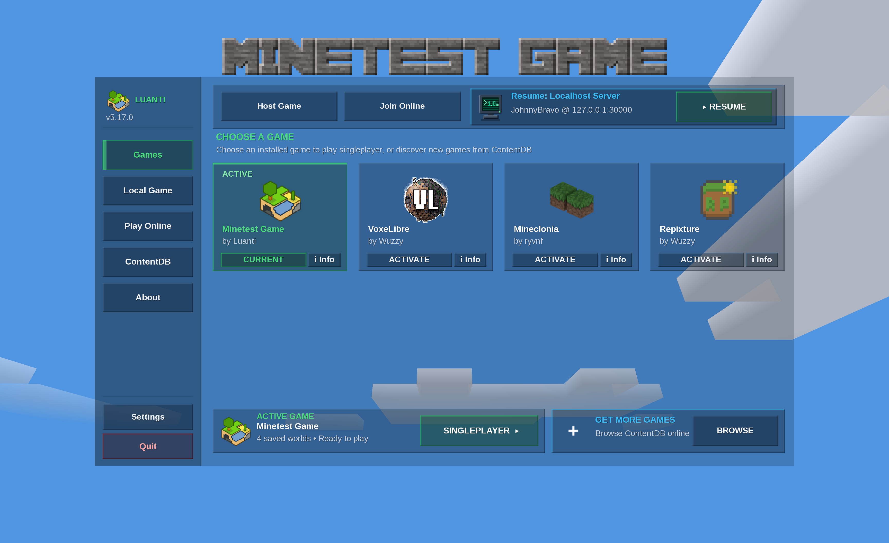

# Luanti Modern Main Menu (Formspec Version 7)

A sleek, high-performance, and modular main menu redesign built natively for **Luanti** using the modern Formspec Version 7 API. This menu replaces the legacy tab views with an immersive translucent glass and voxel-themed interface, intuitive navigation, real-time world metrics, and one-click quick resume functionality.



---

## Overview

The Luanti Modern Main Menu provides a unified, responsive dashboard for managing games, launching singleplayer worlds, hosting multiplayer servers, browsing online communities, and discovering packages on ContentDB.

Designed with clean typography, pixel-accurate voxel controls, and dynamic real-time atmospheric theming, it delivers a modern desktop gaming experience while adhering strictly to Luanti engine conventions and Lua 5.1 compatibility.

---

## Features

### 1. Persistent Sidebar Navigation
- **Quick-Access Tabs**: Instantly switch between **Games**, **Local Game**, **Play Online**, **ContentDB**, and **About**.
- **Branded Engine Header**: Displays the official Luanti voxel logo and current engine version.
- **Global Actions**: Dedicated translucent buttons for engine **Settings** and a custom-tinted **Quit** confirmation dialog.

### 2. Games Chooser & 1-Click Resume
- **Game Grid**: Visual cards for all installed games showing icons, titles, authors, and active statuses, automatically sorted by last played.
- **1-Click Resume Hero Card**: Remembers your most recent session—whether a local singleplayer world or a remote multiplayer server—and lets you jump back into the action immediately.
- **Game Details Modal**: Inspect full descriptions, author metadata, and package IDs parsed directly from `game.conf`.
- **Direct ContentDB Shortcut**: Single-click access to discover and download new games.

### 3. Local Game (Worlds & Hosting)
- **Comprehensive World Browser**: Sortable data view displaying:
  - World Name
  - Engine / Game ID
  - Map Generator (v7, carpathian, valleys, flat, fractal, etc.)
  - Luanti Version compatibility
  - Installed Mod count
  - Calculated world storage size on disk
  - Relative last-played timestamp (Today, Yesterday, X days ago)
- **Top Game Filter Badges**: Filter worlds by game with one click, sorted by recency.
- **Search Bar with Smart Focus**: Search worlds with clear button and real-time query filtering.
- **Custom Voxel Switches**: Custom pixel-art toggle switches for:
  - **Host Server Mode**: Switch between local singleplayer and hosting on LAN/Internet.
  - **Creative Mode**: Toggle unlimited blocks and flight without opening settings.
  - **Enable Damage**: Toggle health and damage mechanics per session.
- **World Management**: Create new worlds with custom seeds and mapgen flags, configure enabled mods, delete worlds, or open the world folder directly in your operating system's file manager.

### 4. Play Online (Public Servers & Favorites)
- **Categorized Server List**: Cleanly organized into **Favorites**, **Public Servers**, and **Incompatible** sections.
- **Advanced Search & Filter Syntax**: Search by server title, address, description, or filter by specific tags:
  - `mod:<name>` (e.g. `mod:mobs`)
  - `player:<name>` (e.g. `player:Johnny`)
  - `game:<name>` (e.g. `game:voxelibre`)
- **Metric Dashboard**: Live counter cards showing favorite count, online player count, total active servers, and ping latency.
- **Detailed Server Sidebar**: View server MOTDs, full descriptions, active player lists, and loaded server mods before connecting.
- **Direct Connect**: Connect to any custom IP address or port (e.g., LAN servers or local dev instances) with favorite bookmarking.

### 5. ContentDB Integration
- **In-Menu Package Management**: Search, install, update, and remove games, mods, and texture packs directly from the official ContentDB repository.
- **Dual View Modes**: Switch between detailed list view and responsive thumbnail grid view.
- **Clean Selection States**: Translucent buttons and emerald outline indicators that match the menu theme.

### 6. About & Hardware Diagnostics
- **Hardware & Driver Information**: Real-time diagnostics showing your active Irrlicht device, graphics driver, and OpenGL renderer.
- **Clean Typography & Logo**: 1:1 pixel-perfect Luanti branding.
- **Contributors & Credits**: Scrollable hypertext credits acknowledging engine authors and core developers.
- **Community Links**: Direct links to documentation, forums, source repository, and issue trackers.

### 7. Dynamic Atmosphere & Voxel Theming
- **Real-Time Sky & Cloud Sync**: In `realtime` theme mode, the main menu background synchronizes with your system clock to reflect dawn, midday, sunset, and nighttime sky and cloud palettes.
- **Unified Button Styling**:
  - **Primary**: Emerald green with distinct hover and pressed feedback.
  - **Secondary**: Translucent slate glass that blends seamlessly into any background.
  - **Danger**: Translucent ruby red for destructive operations.
- **Double-Escaping Immunity**: Custom `theme.escape_once` engine prevents double-escaped punctuation and brackets in translated strings.

---

## File Structure

```
mainmenu/
├── init.lua                 # Engine bootstrap and initialization
├── api.lua                  # Core UI state and update loop
├── theme.lua                # Design system tokens, styles, and formspec generators
├── state.lua                # Reactive state store for tabs, search, and selection
├── dispatcher.lua           # Master event and button click dispatcher
├── view.lua                 # Formspec Version 7 layout assembler
├── game_theme.lua           # Sky and cloud color palette controller
├── serverlistmgr.lua        # Multiplayer server fetcher and favorites manager
├── components/
│   ├── sidebar.lua          # Main persistent navigation sidebar
│   ├── view_games.lua       # Games chooser and quick-resume view
│   ├── view_local.lua       # Singleplayer worlds and hosting view
│   ├── view_online.lua      # Multiplayer server browser view
│   ├── view_content.lua     # ContentDB package manager view
│   └── view_about.lua       # About, diagnostics, and credits view
├── content/                 # ContentDB client and package utilities
├── textures/                # Custom UI textures, icons, and voxel toggle switches
└── screenshot.png           # In-game menu screenshot
```

---

## Installation & Usage

### Manual Installation
1. Locate your Luanti user data directory:
   - **macOS**: `~/Library/Application Support/minetest/`
   - **Linux**: `~/.minetest/` or `~/.local/share/luanti/`
   - **Windows**: `<Luanti Directory>/` (run-in-place) or `%APPDATA%\minetest\`
2. Place the `mainmenu` folder into the user data directory:
   ```bash
   cp -r mainmenu/ ~/Library/Application\ Support/minetest/mainmenu/
   ```
3. Start Luanti. The custom main menu will load automatically on launch.

---

## Configuration (`minetest.conf`)

You can customize the menu behavior and appearance directly in `minetest.conf` or via the in-game Settings menu:

| Setting Key | Allowed Values | Default | Description |
| :--- | :--- | :--- | :--- |
| `menu_theme` | `realtime`, `dark`, `light` | `realtime` | Controls background sky and cloud lighting behavior. |
| `name` | Any valid username | `Player` | Default player name for singleplayer and multiplayer. |
| `serverlist_url` | Valid URL | `https://servers.luanti.org` | Server list endpoint for online multiplayer. |
| `address` | IP / Hostname | `""` | Last connected server address. |
| `remote_port` | Port number | `30000` | Last connected server port. |
| `mainmenu_last_session_type` | `local`, `server` | `local` | Used by the 1-Click Resume hero card. |
| `creative_mode` | `true`, `false` | `false` | Default singleplayer creative mode toggle. |
| `enable_damage` | `true`, `false` | `true` | Default singleplayer damage toggle. |

---

## Development & Quality Assurance

This codebase is strictly verified against the Luanti API standards:
- **Linting**: Passes with `0 warnings / 0 errors` using `luacheck`:
  ```bash
  luacheck --config mainmenu/.luacheckrc mainmenu/
  ```
- **Performance**:
  - Descriptions and credits are cached in memory.
  - World statistics employ smart cache invalidation on world launch, creation, or deletion.
  - Subshell calls for file modification times are eliminated in favor of cached platform format detection.
- **Safety**:
  - No unsafe `pcall` wrappers around core engine functions with well-defined return types.
  - Defensive string trimming compatible with standard Lua 5.1 runtimes.

---

## License

SPDX-License-Identifier: LGPL-2.1-or-later  
Copyright (C) 2014-2026 Luanti contributors
